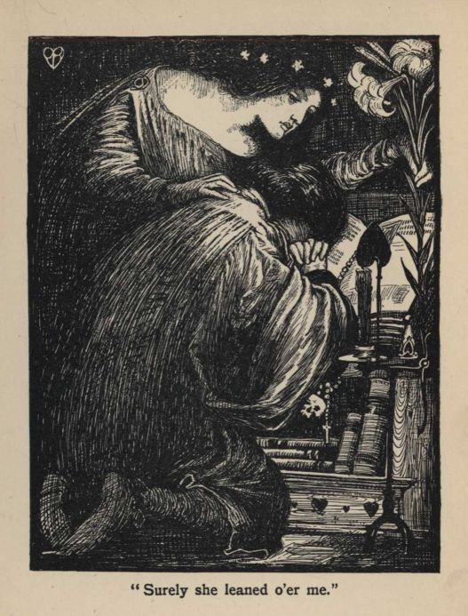
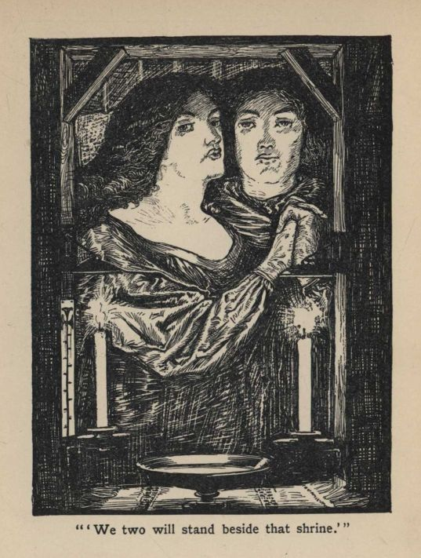
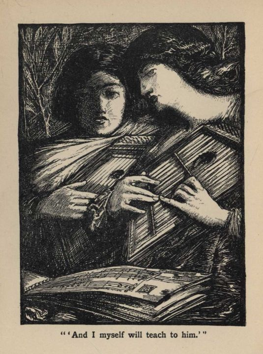
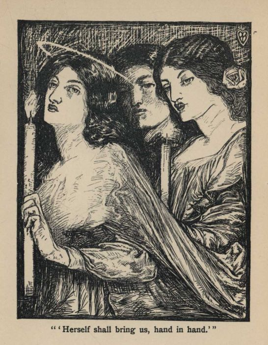
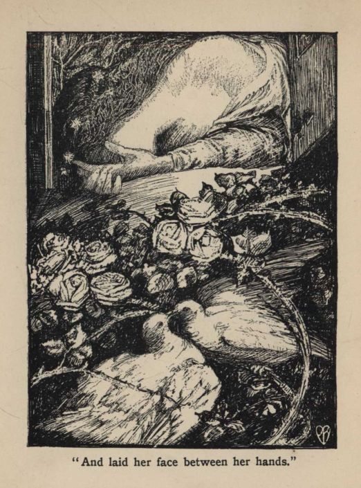
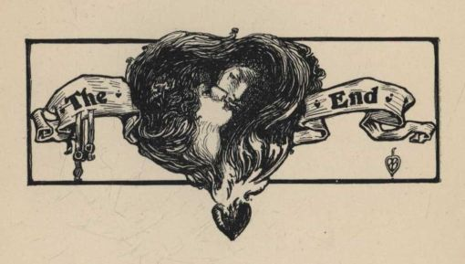

.. -*- encoding: utf-8 -*-

.. meta::
   :PG.Id: 52695
   :PG.Title: The Blessed Damozel
   :PG.Released: 2016-08-01
   :PG.Rights: Public Domain
   :PG.Producer: Al Haines
   :DC.Creator: Dante Gabriel Rossetti
   :MARCREL.ill: Percy Bulcock
   :DC.Title: The Blessed Damozel
   :DC.Language: en
   :DC.Created: 1901
   :coverpage: images/img-cover.jpg

===================
THE BLESSED DAMOZEL
===================

.. clearpage::

.. pgheader::

.. container:: frontispiece

   .. vspace:: 4

   .. class:: center

      FLOWERS OF PARNASSUS—IV.

   .. vspace:: 3

   .. class:: center bold

      THE BLESSED DAMOZEL

   .. vspace:: 3

   .. _`"The blessed Damozel leaned out"`:

   .. figure:: images/img-front.jpg
      :figclass: white-space-pre-line
      :align: center
      :alt: "The blessed Damozel leaned out."

      "The blessed Damozel leaned out."

   .. vspace:: 4

.. container:: titlepage center white-space-pre-line

   .. class:: x-large bold

      THE BLESSED DAMOZEL
      BY DANTE GABRIEL
      ROSSETTI.  WITH
      ILLUSTRATIONS BY PERCY
      BULCOCK

   .. vspace:: 3

   .. class:: medium

      JOHN LANE: PUBLISHER
      LONDON AND NEW YORK
      1901

   .. vspace:: 4

.. container:: verso center white-space-pre-line

   .. class:: small

      Wm. Clowes & Sons, Limited, Printers, London.

   .. vspace:: 4

.. class:: center large bold

   ILLUSTRATIONS.

.. vspace:: 2

`"The blessed Damozel leaned out"`_ . . . Frontispiece

.. vspace:: 1

`Heading`_

.. vspace:: 1

`"Surely she leaned o'er me"`_

.. vspace:: 1

`"'We two will stand beside that shrine'"`_

.. vspace:: 1

`"'And I myself will teach to him'"`_

.. vspace:: 1

`"'Herself shall bring us, hand in hand'"`_

.. vspace:: 1

`"And laid her face between her hands"`_

.. vspace:: 1

`Tailpiece`_

.. vspace:: 4

..

   .. _`Heading`:

   .. figure:: images/img-009.jpg
      :figclass: white-space-pre-line
      :align: center
      :alt: "Heading"

      Heading

.. vspace:: 2

..

   |  I.

   |  The blessed Damozel leaned out
   |    From the gold bar of Heaven:
   |  Her blue-grey eyes were deeper much
   |    Than a deep water, even.
   |  She had three lilies in her hand,
   |    And the stars in her hair were seven.

.. vspace:: 2

..

   |  II.

   |  Her robe, ungirt from clasp to hem,
   |    No wrought flowers did adorn,
   |  But a white rose of Mary's gift
   |    On the neck meetly worn;
   |  And her hair, lying down her back,
   |    Was yellow like ripe corn.

.. vspace:: 2

..

   |  III.

   |  Herseemed she scarce had been a day
   |    One of God's choristers;
   |  The wonder was not yet quite gone
   |    From that still look of hers;
   |  Albeit to them she left, her day
   |    Had counted as ten years.

.. vspace:: 2

..

   |  IV.

   |  (To *one* it is ten years of years
   |    . . . Yet now, here in this place,
   |  Surely she leaned o'er me,—her hair
   |    Fell all about my face . . .
   |  Nothing: the Autumn-fall of leaves.
   |    The whole year sets apace.)

.. vspace:: 3

.. _`"Surely she leaned o'er me"`:

   "Surely she leaned o'er me."

.. vspace:: 3

..

   |  V.

   |  It was the terrace of God's house
   |    That she was standing on,—
   |  By God built over the sheer depth
   |    In which Space is begun;
   |  So high, that looking downward thence,
   |    She could scarce see the sun.

.. vspace:: 2

..

   |  VI.

   |  It lies from Heaven across the flood
   |    Of ether, as a bridge.
   |  Beneath, the tides of day and night
   |    With flame and blackness ridge
   |  The void, as low as where this earth
   |    Spins like a fretful midge.

.. vspace:: 2

..

   |  VII.

   |  But in those tracts, with her, it was
   |    The peace of utter light
   |  And silence.  For no breeze may stir
   |    Along the steady flight
   |  Of seraphim; no echo there,
   |    Beyond all depth or height.

.. vspace:: 2

..

   |  VIII.

   |  Heard hardly, some of her new friends,
   |    Playing at holy games,
   |  Spake, gentle-mouthed, among themselves,
   |    Their virginal chaste names;
   |  And the souls, mounting up to God,
   |    Went by her like thin flames.

.. vspace:: 2

..

   |  IX.

   |  And still she bowed herself, and stooped
   |    Into the vast waste calm;
   |  Till her bosom's pressure must have made
   |    The bar she leaned on warm,
   |  And the lilies lay as if asleep
   |    Along her bended arm.

.. vspace:: 2

..

   |  X.

   |  From the fixt lull of heaven, she saw
   |    Time, like a pulse, shake fierce
   |  Through all the worlds.  Her gaze still strove,
   |    In that steep gulph, to pierce
   |  The swarm: and then she spake, as when
   |    The stars sang in their spheres.

.. vspace:: 2

..

   |  XI.

   |  "I wish that he were come to me,
   |    For he will come," she said.
   |  "Have I not prayed in solemn heaven?
   |    On earth, has he not prayed?
   |  Are not two prayers a perfect strength?
   |    And shall I feel afraid?

.. vspace:: 2

..

   |  XII.

   |  "When round his head the aureole clings,
   |    And he is clothed in white,
   |  I'll take his hand, and go with him
   |    To the deep wells of light,
   |  And we will step down as to a stream
   |    And bathe there in God's sight.

.. vspace:: 3

.. _`"'We two will stand beside that shrine'"`:

   "'We two will stand beside that shrine.'"

.. vspace:: 3

..

   |  XIII.

   |  "We two will stand beside that shrine,
   |    Occult, withheld, untrod,
   |  Whose lamps tremble continually
   |    With prayer sent up to God;
   |  And where each need, revealed, expects
   |    Its patient period.

.. vspace:: 2

..

   |  XIV.

   |  "We two will lie i' the shadow of
   |    That living mystic tree,
   |  Within whose secret growth the Dove
   |    Sometimes is felt to be,
   |  While every leaf that His plumes touch
   |    Saith His name audibly.

.. vspace:: 2

..

   |  XV.

   |  "And I myself will teach to him—
   |    I myself, lying so—
   |  The songs I sing here; which his mouth
   |    Shall pause in, hushed and slow,
   |  Finding some knowledge at each pause
   |    And some new thing to know."

.. vspace:: 2

..

   |  XVI.

   |  (Alas! to *her* wise simple mind
   |    These things were all but known
   |  Before: they trembled on her sense,—
   |    Her voice had caught their tone.
   |  Alas for lonely Heaven!  Alas
   |    For life wrung out alone!

.. vspace:: 3

.. _`"'And I myself will teach to him'"`:

   "'And I myself will teach to him.'"

.. vspace:: 3

..

   |  XVII.

   |  Alas, and though the end were reached?
   |    Was *thy* part understood
   |  Or borne in trust?  And for her sake
   |    Shall this too be found good?—
   |  May the close lips that knew not prayer
   |    Praise ever, though they would?)

.. vspace:: 2

..

   |  XVIII.

   |  "We two," she said, "will seek the groves
   |    Where the lady Mary is,
   |  With her five handmaidens, whose names
   |    Are five sweet symphonies:—
   |  Cecily, Gertrude, Magdalen,
   |    Margaret, and Rosalys.

.. vspace:: 2

..

   |  XIX.

   |  "Circle-wise sit they, with bound locks
   |    And bosoms coveréd;
   |  Into the fine cloths, white like flame,
   |    Weaving the golden thread,
   |  To fashion the birth-robes for them
   |    Who are just born, being dead.

.. vspace:: 2

..

   |  XX.

   |  He shall fear haply, and be dumb.
   |    Then will I lay my cheek
   |  To his, and tell about our love,
   |    Not once abashed or weak:
   |  And the dear Mother will approve
   |    My pride, and let me speak.

.. vspace:: 3

.. _`"'Herself shall bring us, hand in hand'"`:

   "'Herself shall bring us, hand in hand.'"

.. vspace:: 3

..

   |  XXI.

   |  'Herself shall bring us, hand in hand,
   |    To Him round whom all souls
   |  Kneel—the unnumber'd solemn heads
   |    Bowed with their aureoles:
   |  And Angels, meeting us, shall sing
   |    To their citherns and citoles.

.. vspace:: 2

..

   |  XXII.

   |  "There will I ask of Christ the Lord
   |    Thus much for him and me:—
   |  To have more blessing than on earth
   |    In nowise; but to be
   |  As then we were,—being as then
   |    At peace.  Yea, verily.

.. vspace:: 2

..

   |  XXIII.

   |  "Yea, verily; when he is come
   |    We will do thus and thus:
   |  Till this my vigil seem quite strange
   |    And almost fabulous;
   |  We two will live at once, one life;
   |    And peace will be with us."

.. vspace:: 2

..

   |  XXIV.

   |  She gazed, and listened, and then said,
   |    Less sad of speech than mild;
   |  "All this is when he comes."  She ceased;
   |    The light thrilled past her, filled
   |  With Angels, in strong level lapse.
   |    Her eyes prayed, and she smiled.

.. vspace:: 3

.. _`"And laid her face between her hands"`:

   "And laid her face between her hands."

.. vspace:: 3

..

   |  XXV.

   |  (I saw her smile.)  But soon their flight
   |    Was vague 'mid the poised spheres.
   |  And then she cast her arms along
   |    The golden barriers,
   |  And laid her face between her hands,
   |    And wept (I heard her tears).

.. vspace:: 3

.. _`Tailpiece`:

   THE END

.. vspace:: 3

.. class:: center white-space-pre-line

   \*      \*      \*      \*      \*      \*      \*      \*

.. vspace:: 4

.. class:: center x-large bold

   The Lover's Library

.. vspace:: 2

.. class:: center large bold

   Edited by Frederic Chapman

.. class:: center small

   Size, 5¼ X 3 inches

.. class:: center small white-space-pre-line

   Price 1/6 net Bound in Cloth Price 50 cents net
   Price 2/- net Bound in Leather Price 75 cents net

.. vspace:: 2

.. class:: noindent white-space-pre-line

Vol. I.  THE LOVE POEMS OF SHELLEY
Vol. II.  THE LOVE POEMS OF BROWNING
Vol. III.  THE SILENCE OF LOVE

.. vspace:: 2

.. class:: noindent white-space-pre-line

By Edmond Holmes

.. class:: noindent white-space-pre-line

Vol. IV.  THE CUPID AND PSYCHE of Apuleius in English.
Vol. V.  THE LOVE POEMS OF TENNYSON
Vol. VI.  THE LOVE POEMS OF LANDOR

.. vspace:: 1

.. class:: center

   *Other Volumes in Preparation*

.. vspace:: 2

The title of The Lover's Library is sufficiently descriptive
to make explanation of the purpose of the Series almost
unnecessary.

.. vspace:: 1

It is sought to include in a group of compact little volumes
the best Love Poems of the great British poets; and from time
to time a volume of prose, or a volume of modern verse which
may be considered of sufficient importance, will be added to the
Library.

.. vspace:: 1

The delicate decorations, on the pages, end papers, and covers,
make the little books dainty enough for small presents, and it is
hoped that those who do not receive them as presents from others
will seize the opportunity of making presents to themselves.

.. vspace:: 1

.. class:: center

   JOHN LANE, London & New York

.. vspace:: 3

.. class:: center white-space-pre-line

   \*      \*      \*      \*      \*      \*      \*      \*

.. vspace:: 3

.. class:: center x-large bold

   Flowers of Parnassus

.. vspace:: 2

.. class:: center small

   *A Series of Famous Poems Illustrated*

.. class:: center large bold white-space-pre-line

   Under the General Editorship of
   \F. \B. Money-Coutts

.. vspace:: 1

.. class:: center small

   Demy 16mo. (5½ X 4¼), gilt top

.. vspace:: 1

.. class:: center small

   Price 1/- net Cloth Price 50 cents net
   Price 1/6 net Leather Price 75 cents net

.. vspace:: 2

Vol. I.  Gray's Elegy and Ode on a Distant Prospect of Eton
College.  *With Twelve Illustrations by J. T. Friedenson*.

.. vspace:: 1

Vol. II.  The Statue and the Bust.  By Robert Browning.  *With
Nine Illustrations by Philip Connard*.

.. vspace:: 1

Vol. III.  Marpessa.  By Stephen Phillips.  *With Seven
Illustrations by Philip Connard*.

.. vspace:: 1

IV.  The Blessed Damozel.  By Dante Gabriel Rossetti.
*With Eight Illustrations by Percy Bulcock*.

.. vspace:: 1

Vol. V.  The Nut-Brown Maid.  A New Version by F. B. Money-Coutts.
*With Nine Illustrations by Herbert Cole*.

.. vspace:: 1

Vol. VI.  A Dream of Fair Women.  By Alfred Tennyson.  *With
Illustrations*.

.. vspace:: 1

Vol. VII.  A Day Dream.  By Alfred Tennyson.  *With Eight
Illustrations by Amelia Bauerle*.

.. vspace:: 1

Vol. VIII.  A Ballade upon a Wedding.  By Sir John Suckling.
*With Nine Illustrations by Herbert Cole*.

.. vspace:: 2

.. class:: center small

   *Other Volumes in Preparation.*

.. vspace:: 2

.. class:: center

   JOHN LANE, London & New York

.. vspace:: 6

.. pgfooter::
